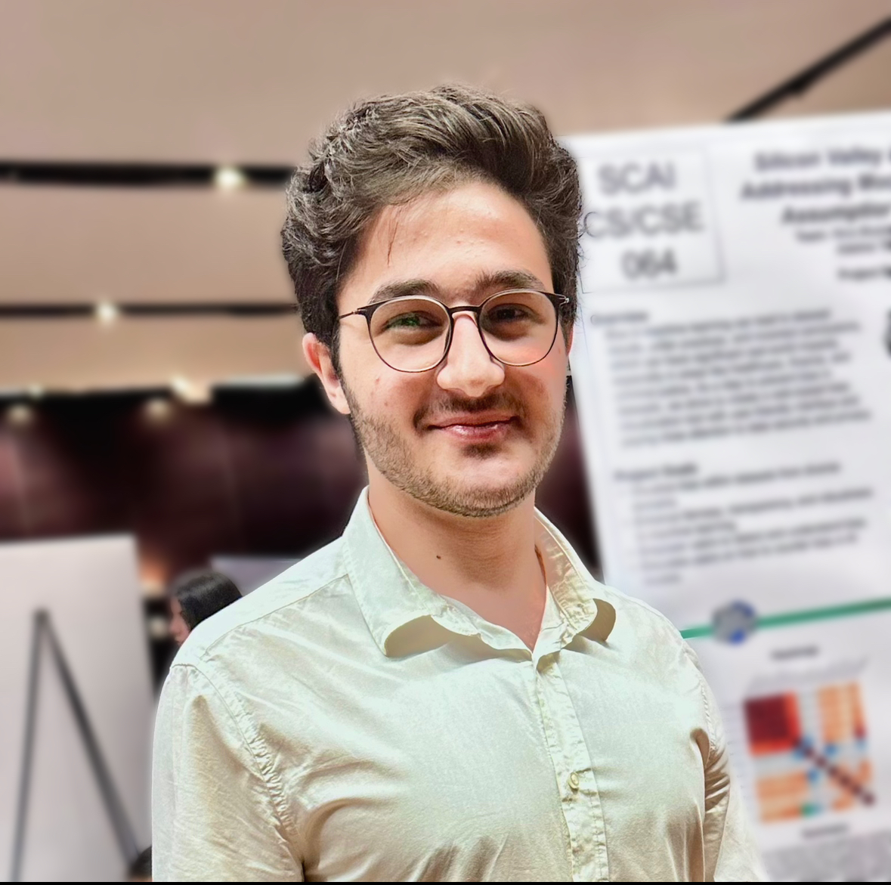

Welcome

  My name is [Laith Abou Saleh](about.html), and I'm a Software Developer
  with a strong passion for Cybersecurity and Data Science.
  I've developed various CLI tools and scripts that facilitate routine tasks.
  My interest lies in automating tasks to enhance efficiency and productivity.
  Feel free to explore my portfolio and reach out with any employment opportunities.

  

